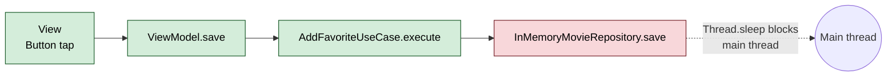
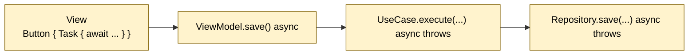
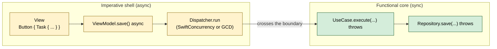
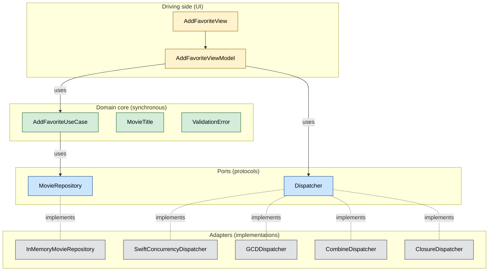

# AsyncLeakDemo

A small SwiftUI iOS app that demonstrates how `async/await` can quietly contaminate a domain layer — and how to keep it out.

The example is deliberately tiny (one screen, one use case) so the architectural shift between branches is the focus, not the application logic. Each branch is a self-contained iOS project that builds, runs, and passes its tests; switching between branches lets you see the same feature implemented under four different architectural choices.

> Background reading: [*When asynchrony leaks into your domain layer*](https://medium.com/@oliverperez.e/when-asynchrony-leaks-into-your-domain-layer-6204f03b4663) (Medium).

## TL;DR

Asynchrony is an *infrastructure* concern. Most domain logic — validation, calculation, decision-making — is synchronous by nature. When a repository or service is implemented with `async` functions, the `async` keyword tends to propagate upward into use cases, view models, views, and tests, even though those layers are not doing any inherently asynchronous work. This repo shows the propagation happening, then shows a small `Dispatcher` abstraction that contains async at the boundary so the rest of the app can stay synchronous.

## The four stages

Each stage is a long-lived branch and a tag. The repo's `main` is identical to `stage-4-execution-strategies` plus this README.

| Branch                            | Tag             | Architecture        | Behaviour                                                        |
| --------------------------------- | --------------- | ------------------- | ---------------------------------------------------------------- |
| `stage-1-sync-baseline`           | `v1-sync`       | Synchronous         | UI freezes for ~1.5s while the repository simulates a slow save  |
| `stage-2-async-leak`              | `v2-leak`       | Async propagated    | UI stays responsive, but `async` has spread through every layer  |
| `stage-3-dispatcher-fix`          | `v3-fix`        | Sync + Dispatcher   | UI responsive, domain restored to synchronous code               |
| `stage-4-execution-strategies`    | `v4-execution`  | Sync + GCD adapter  | Same architecture as Stage 3, swapped to a non-cooperative queue |

## Architecture, visualised

The same feature — *add a movie title to favorites* — is implemented in three architecturally different ways across the four stages. The diagrams below trace where async lives in each.

### Stage 1 — synchronous everywhere

The cleanest architecture, but the repository's blocking call sits on the main thread, freezing the UI.



### Stage 2 — async propagated everywhere

The repository was made `async`. The compiler then *required* `async` on every type that calls it, including types whose work is purely synchronous.



The validation logic in `AddFavoriteUseCase` does not actually need to suspend — there is nothing asynchronous about trimming a string and checking its length. The `async` keyword is present only because the call to `repository.save` demands it. The same pattern then appears in tests, which become async out of obligation rather than need.

### Stages 3 and 4 — async at the boundary

A `Dispatcher` port is introduced. The domain and repository revert to synchronous code. The view model holds a `Dispatcher` and bridges from main-actor async to a synchronous call:

```swift
let title = try await dispatcher.run { try useCase.execute(raw) }
```



Stage 4 differs from Stage 3 only in *which* `Dispatcher` adapter is wired up at the composition root.

### Ports and adapters

The hexagonal view of the final architecture:



### Execution strategies — the four Dispatcher adapters

The `Dispatcher` port has four interchangeable adapters. Switching between them is a one-line change in the composition root; nothing else moves.

| Adapter                       | Mechanism                                                | When to choose it                                                                       |
| ----------------------------- | -------------------------------------------------------- | --------------------------------------------------------------------------------------- |
| `SwiftConcurrencyDispatcher`  | `Task.detached(priority:)`                               | Non-blocking work that fits Swift Concurrency's structured model.                       |
| `GCDDispatcher`               | `DispatchQueue.global().async` + checked continuation    | Blocking I/O (`Thread.sleep`, sync DB drivers, blocking C libraries) where the cooperative pool must not be starved. Production default in this repo. |
| `CombineDispatcher`           | `Future` on a queue, bridged back to async               | When surrounding code is already Combine-shaped and composing publishers is desirable.  |
| `ClosureDispatcher`           | Caller-supplied scheduling closure, bridged via continuation | Bridging callback-based APIs, third-party SDKs, or C interop.                       |

## Project layout

The same file layout is used on every stage branch. Files marked with **⚠** change shape between stages.

```
AsyncLeakDemo/
├── AsyncLeakDemoApp.swift          composition root — wires the object graph
├── ContentView.swift
├── Domain/
│   ├── MovieTitle.swift            value object
│   ├── ValidationError.swift
│   └── AddFavoriteUseCase.swift    ⚠ sync on stages 1, 3, 4 — async on stage 2
├── Repository/
│   ├── MovieRepository.swift       ⚠ protocol — sync or async per stage
│   └── InMemoryMovieRepository.swift  ⚠ Thread.sleep / Task.sleep
├── Presentation/
│   ├── AddFavoriteView.swift       includes a MainThreadHeartbeat
│   └── AddFavoriteViewModel.swift  ⚠ uses Dispatcher on stages 3, 4
└── Infrastructure/                 stages 3 and 4 only
    ├── Dispatcher.swift                 port
    ├── SwiftConcurrencyDispatcher.swift  adapter — Task.detached (stage 3)
    ├── GCDDispatcher.swift               adapter — DispatchQueue.global (stage 4)
    ├── CombineDispatcher.swift           adapter — Future + queue (stage 4)
    └── ClosureDispatcher.swift           adapter — schedule-with-closure (stage 4)

AsyncLeakDemoTests/
├── AddFavoriteUseCaseTests.swift   ⚠ sync on stages 1, 3, 4 — async on stage 2
└── FakeMovieRepository.swift       ⚠ class on stages 1, 3, 4 — actor on stage 2
```

`AddFavoriteView` shows a small *MainThreadHeartbeat* — a `TimelineView(.animation)`-driven rotating icon and millisecond clock — so any time the main thread is blocked, the freeze is visible to the eye. On Stage 1 the heartbeat halts mid-rotation; on Stages 2–4 it continues to tick during a save.

## Comparing the stages

A few `git diff` invocations make the architectural deltas concrete.

The `async` propagation between Stages 1 and 2 — note how a sync `@Test` becomes an async one and the fake repository becomes an `actor`:

```sh
git diff v1-sync v2-leak -- AsyncLeakDemoTests/AddFavoriteUseCaseTests.swift \
                            AsyncLeakDemoTests/FakeMovieRepository.swift
```

The domain layer between Stages 1 and 3, after the dispatcher boundary is introduced — the diff is empty, because the domain is identical:

```sh
git diff v1-sync v3-fix -- AsyncLeakDemo/Domain/ \
                           AsyncLeakDemo/Repository/ \
                           AsyncLeakDemoTests/
```

The composition root between Stages 3 and 4 — a one-line change swaps the execution strategy:

```sh
git diff v3-fix v4-execution -- AsyncLeakDemo/AsyncLeakDemoApp.swift
```

## Running locally

Requirements: **Xcode 26.1+** (iOS 26.1 SDK, Swift 5+).

```sh
git clone https://github.com/oliver-perez/AsyncLeakDemo.git
cd AsyncLeakDemo
open AsyncLeakDemo.xcodeproj
```

Pick a stage with `git checkout <branch>` (or `git checkout <tag>` to detach), then build and run on an iOS simulator. Type a movie title (≥ 2 characters) and tap **Save**:

- On `stage-1-sync-baseline`, the heartbeat row visibly freezes for ~1.5 seconds.
- On `stage-2-async-leak`, `stage-3-dispatcher-fix`, and `stage-4-execution-strategies`, the heartbeat keeps ticking smoothly during the save.

Tests can be run with the Xcode test action, or from the command line:

```sh
xcodebuild -project AsyncLeakDemo.xcodeproj \
           -scheme AsyncLeakDemo \
           -destination 'platform=iOS Simulator,name=iPhone 17' \
           test
```

## Design principles in play

The architecture is a faithful application of five well-known ideas. Each is named below with its source and tied to a specific type or file in this repo.

### Hexagonal Architecture / Ports & Adapters

*Alistair Cockburn, 2005.*

Hexagonal Architecture places the application core at the center and lets everything that talks to the outside world plug into it through *ports* (interfaces) implemented by *adapters* (concrete classes).

In this repo:

- `MovieRepository` is a port. `InMemoryMovieRepository` is an adapter for it.
- `Dispatcher` is a port. `SwiftConcurrencyDispatcher`, `GCDDispatcher`, `CombineDispatcher`, and `ClosureDispatcher` are four adapters for the same port. Each picks a different mechanism (Swift Concurrency, GCD, Combine, raw callback scheduling) without the domain noticing.

Adding new dispatchers without changing the domain is the ports-and-adapters guarantee in action: same hex, different plug.

### Clean Architecture's Dependency Rule

*Robert C. Martin, 2012 blog post / 2017 book.*

Source-code dependencies must point only inward, toward higher-level policy. Frameworks, async runtimes, and I/O libraries are outer-ring concerns; the domain is the innermost ring and must not import them.

`AsyncLeakDemo/Domain/` only imports `Foundation`. It does not import `Combine`, `URLSession`, or anything async-related. On Stage 2 the import list looks identical, but the *signatures* now carry `async` — that's the contamination, even though the imports are clean. The Dependency Rule is about both imports and signatures.

### Functional Core, Imperative Shell

*Gary Bernhardt, "Boundaries" — RubyConf 2012.*

A simple two-layer mental model:

- **Functional core** — `Domain/AddFavoriteUseCase.swift`. Pure, deterministic, synchronous. Trivially testable; no test doubles needed beyond a fake repository that just appends to an array.
- **Imperative shell** — `AsyncLeakDemoApp.swift` (composition root) plus `Infrastructure/*Dispatcher.swift`. Side effects, threading, async — the parts that talk to the world. Hard to test, but small and isolated.

Stages 1 and 3 share the same functional core; only the imperative shell differs.

### SOLID — specifically SRP, DIP, and OCP

*Robert C. Martin,* Agile Software Development *(2002).*

- **SRP (Single Responsibility Principle).** `Dispatcher` exists to do one thing: execute synchronous work asynchronously. `AddFavoriteUseCase` exists to validate input and delegate persistence. Neither has a second reason to change; threading and validation never co-change in this repo.
- **DIP (Dependency Inversion Principle).** `AddFavoriteUseCase` depends on `any MovieRepository`, never on `InMemoryMovieRepository`. The view model depends on `any Dispatcher`, never on `Task.detached` or `DispatchQueue`. Concrete types appear only at the composition root.
- **OCP (Open/Closed Principle).** Stage 4 introduced `GCDDispatcher` without modifying any existing type. The composition root changed by one line, but composition roots are *meant* to change when wiring new things in.

LSP and ISP are not particularly exercised in such a small example.

### DDD — partial fit

*Eric Evans,* Domain-Driven Design *(2003).*

The example uses a few DDD building blocks:

- **Repository pattern** — `MovieRepository` as an abstraction over persistence.
- **Value object** — `MovieTitle` is an immutable type defined by its value, not its identity.
- **Application service / use case** — `AddFavoriteUseCase` orchestrates a single user-driven operation.

What this repo does *not* exercise — and what DDD is mostly about — is aggregates and aggregate roots, domain events, bounded contexts and context maps, and ubiquitous language coordinated with domain experts. The instinct *"keep infrastructure out of the domain"* is sometimes credited to DDD in casual conversation, but it more accurately belongs to Hexagonal / Clean Architecture. DDD is fundamentally about *modeling the problem*; Hexagonal/Clean are about *structuring the solution*.

### Tying it together

All five ideas converge on the same shape: **the domain is a small, stable thing that knows nothing about how its work runs.** Hexagonal calls the seams "ports". Clean calls them "boundaries". Bernhardt calls them the line between functional core and imperative shell. SOLID's DIP says to depend on the abstractions on either side of those seams.

When the seams are in the right places, swapping `Task.detached` for `DispatchQueue.global` is a one-line change — because the only place that knew about either was the composition root.

## Glossary

- **Async contamination** — `async` spreading from infrastructure into domain code that has no asynchronous work of its own.
- **Boundary** — the place where async work is contained, typically the composition root plus a dispatcher abstraction.
- **Composition root** — the single place that wires concrete implementations into the object graph (`AsyncLeakDemoApp.swift` in this repo).
- **Cooperative thread pool** — Swift Concurrency's shared pool of worker threads. Blocking I/O on this pool can starve other tasks; `DispatchQueue.global` does not share it.
- **Execution strategy** — the concrete adapter behind the `Dispatcher` port; what does the suspending. `Task.detached`, `DispatchQueue.global`, and others are interchangeable strategies.
- **Port / Adapter** — Hexagonal Architecture terms. A port is an interface defined by the application core; an adapter is a concrete implementation that fulfils the port using an outside technology.
